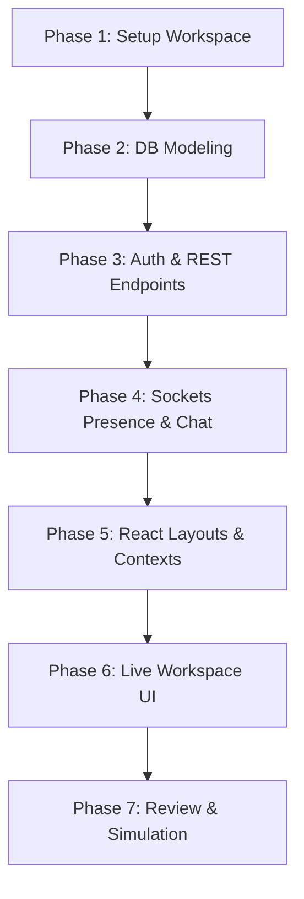

# 🪐 PulseNet: Real-Time Community Discussion Forum

PulseNet is a production-grade, highly responsive, full-stack community collaboration ecosystem that combines persistent forum threads (posts, recursive comments, tags, upvoting/downvoting) with sub-second, real-time workspace rooms (DMs, active presence tracking, typing notifications) powered by Node.js, Express, MongoDB, and WebSockets (Socket.io).

---

## 1. Project Explanation

### A. Simple Explanation
Think of PulseNet as a powerful hybrid between **Reddit** and **Discord**. 
* The **Reddit aspect** lets users publish structured posts, sort discussions with tag pills, and upvote/downvote ideas so the best insights rise to the top.
* The **Discord aspect** offers sub-second live workspace chat rooms (like `#general` or `#dev-talk`) where active members can chat instantly, see typing bubbles, and watch who is currently online, all without reloading the page.

### B. Technical Explanation
From a software engineering perspective, PulseNet is a dual-communication engine:
* **Asynchronous Communication Layer**: Driven by a RESTful HTTP API (Express + MongoDB) that handles persistence, user authorization (JWT), tags filtering, and cascaded deletions. Mongoose pre-save middlewares calculate upvote/downvote scores dynamically before database saves.
* **Synchronous Real-Time Communication Layer**: Powered by WebSockets (Socket.io). A persistent TCP connection keeps connection structures in memory, driving sub-second updates for active online lists (presence), message broadcasts, and typing loops.

### C. Workflow
1. **User Registration** → 2. **Authentication (JWT Generation)** → 3. **Explore Dashboard** → 4. **Create Discussion Thread** → 5. **Engage with Comments** → 6. **Enter Live Workspace** → 7. **Instant Websockets Synchronization**

---

## 2. Tech Stack Options

| Feature | Option A: Easy | Option B: Intermediate (PulseNet Preferred) | Option C: Advanced |
| :--- | :--- | :--- | :--- |
| **Frontend** | HTML, CSS, Vanilla JS | **React, Tailwind CSS, Lucide Icons** | Next.js, Framer Motion, TypeScript |
| **Backend** | Express.js, Local files | **Express.js, Node.js ES Modules** | NestJS, TypeScript, BullMQ |
| **Database** | Local JSON Store | **MongoDB & Mongoose ODM** | PostgreSQL & Prisma ORM |
| **Real-time** | AJAX Polling (Intervals) | **Socket.io WebSockets** | Socket.io + Redis Pub/Sub scale |

> [!TIP]
> **Why Option B is best for students:** Option B provides the exact industry-standard tech stack (MERN) expected by top-tier tech companies. It uses clean, modern ES Modules syntax rather than legacy CommonJS, and exposes students to true duplex communication (Socket.io) without introducing the deployment complexities of Redis queues or Kubernetes orchestration.

---

## 3. Project Architecture

### A. System Ecosystem
* **client/**: Vite-based React Single Page Application (SPA) styled with Tailwind CSS dark-mode tokens. Uses React Router DOM for page navigation.
* **server/**: Express.js REST API and Socket.io gateway engine. Connects to MongoDB to store users, threads, comments, and messages.

```
                  ┌────────────────────────────────────────┐
                  │               CLIENT UI                │
                  │    Vite React Single Page Application  │
                  └──────┬──────────────────────────┬──────┘
                         │                          │
          HTTP / REST    │                          │   WebSockets (persistent)
          JSON payloads  │                          │   typing, presence, msgs
                         ▼                          ▼
            ┌─────────────────────────┐   ┌─────────────────────────┐
            │       API ENGINE        │   │      SOCKET GATEWAY     │
            │     Express Server      │   │     Socket.io Node      │
            └────────────┬────────────┘   └────────────┬────────────┘
                         │                             │
                         │   Mongoose ODM Queries      │  Direct broadcast
                         ▼                             ▼
                   ┌───────────┐                 ┌───────────┐
                   │  DATABASE │ ◄───────────────┤   CACHE   │
                   │  MongoDB  │  Persist log    │   Redis   │
                   └───────────┘  optionally     └───────────┘
```

### B. Core REST API Endpoints
* **Authentication**:
  * `POST /api/auth/register` - Create user profile & return token
  * `POST /api/auth/login` - Authenticate credentials & return token
  * `GET /api/auth/me` - Get current user profile (JWT protected)
* **Forums**:
  * `GET /api/discussions` - List threads (supports tags & search)
  * `GET /api/discussions/:id` - Fetch detailed thread with author fields
  * `POST /api/discussions` - Publish new discussion thread (protected)
  * `POST /api/discussions/:id/vote` - Upvote/downvote thread (protected)
  * `DELETE /api/discussions/:id` - Delete thread & comments (protected)
* **Comments**:
  * `GET /api/comments/discussion/:discussionId` - Get comments for thread
  * `POST /api/comments` - Post comment (supports threaded parent replies)
  * `POST /api/comments/:id/vote` - Upvote/downvote comment (protected)
  * `DELETE /api/comments/:id` - Delete comment (protected)
* **Messages**:
  * `GET /api/messages/:channel` - Get channel chat history (protected)

---

## 4. Folder Structure

```
Community-Discussion-Forum-RealTime-Chat/
│
├── client/                      # React SPA powered by Vite
│   ├── public/                  # Static assets and placeholders
│   ├── src/
│   │   ├── components/          # Reusable view cards (Navbar, ThreadCard, CommentSection)
│   │   ├── pages/               # Routed pages (Login, Register, Dashboard, ChatRooms, CreateThread, ThreadDetail)
│   │   ├── App.jsx              # Global AuthContext & Socket router mapping
│   │   ├── index.css            # Tailwind directives and custom dark-mode scrollbars
│   │   └── main.jsx             # React DOM root mounting
│   ├── package.json             # Frontend dependency configuration
│   ├── tailwind.config.js       # Premium theme customized tokens
│   └── vite.config.js           # Proxy configurations for /api paths
│
├── server/                      # Express backend & WebSockets server
│   ├── src/
│   │   ├── config/              # MongoDB and environment utilities
│   │   ├── controllers/         # API business logics (Auth, Discussion, Comments, Messages)
│   │   ├── middleware/          # JWT protect and role authorize filters
│   │   ├── models/              # Mongoose schemas (User, Discussion, Comment, Message)
│   │   ├── routes/              # Express endpoint routing maps
│   │   ├── sockets/             # Socket.io connection and broadcast handlers
│   │   └── index.js             # Main server entry file
│   ├── .env                     # Local environment parameters (gitignored)
│   ├── .env.example             # Env variables template
│   └── package.json             # Backend dependency configuration
│
└── README.md                    # Master documentation file
```

---

## 5. Phase-wise Implementation Plan



### Phase 1: Workspace & Setup
* **What**: Structure root workspaces, generate package files, and install server dependencies.
* **Why**: Establishes correct boundaries and prevents importing mixed client/server libraries.
* **Mistake to Avoid**: Mixing node modules in a single directory which creates dependency conflicts.

### Phase 2: Mongoose Database Modeling
* **What**: Code database schemas for Users, Discussions, Comments, and Messages with pre-save vote hook calculators.
* **Why**: Strongly-typed schemas prevent inconsistent data saves to MongoDB.
* **Mistake to Avoid**: Storing votes as simple numbers without binding user IDs, causing users to vote infinite times.

### Phase 3: REST API & JWT Engine
* **What**: Code registration, login, and CRUD endpoints with token verification middlewares.
* **Why**: Establishes server-side authorization blocks before building any UI views.
* **Mistake to Avoid**: Returning passwords in login query responses; always select `+password` explicitly inside auth controllers.

### Phase 4: WebSockets Presence & Broadcasts
* **What**: Establish Socket.io server with JWT verification interceptors. Manage rooms, typing broadcasts, and online presence arrays.
* **Why**: Enables dual full-duplex communication alongside secure HTTP REST channels.
* **Mistake to Avoid**: Broadcasting socket messages globally using `io.emit()` instead of scoping to channels with `io.to(channel).emit()`.

### Phase 5: Client Foundations & Global Contexts
* **What**: Configure Tailwind styling rules, router links, `AuthContext` status, and auto-connecting `SocketContext`.
* **Why**: Prevents opening multiple sockets, keeping a single connection active per session.
* **Mistake to Avoid**: Initializing socket clients globally outside React trees, causing connections to re-open on every page shift.

### Phase 6: Thread Listing & Nested Conversations
* **What**: Build feed lists, upvoting buttons, thread creators, and recursive nested comment blocks.
* **Why**: Enables intuitive nested responses so users can discuss complex ideas logically.
* **Mistake to Avoid**: Direct Mongoose deep nest lookups; populate root records and let React recursively render children.

### Phase 7: Live Workspace Interface
* **What**: Code a multi-panel workspace view displaying channels lists, message log screens, typing indicators, and user lists.
* **Why**: Delivers a sub-second Slack/Discord-grade community experience.
* **Mistake to Avoid**: Failing to scroll chat panels automatically on new message arrivals.

---

## 6. Installation & Run Guide

### A. Environment Variable Variables Configuration
Create a `.env` file in the `/server` directory and paste:
```env
PORT=5000
NODE_ENV=development
MONGODB_URI=mongodb://127.0.0.1:27017/pulsenet
JWT_SECRET=your_super_strong_secret_key_12345
CLIENT_URL=http://localhost:5173
```

### B. Quick Launch Commands (Windows/Mac)
You will need two terminal windows open:

#### Terminal 1: Launch Backend Engine
```bash
cd server
npm install
npm run dev
```
*Expected Server Output:*
```
🔄 Connecting to MongoDB...
💚 Connected to MongoDB successfully!
🚀 PulseNet Server running in development mode on http://localhost:5000
```

#### Terminal 2: Launch React UI Web App
```bash
cd client
npm install
npm run dev
```
*Expected Client Output:*
```
  VITE v5.2.8  ready in 234 ms

  ➜  Local:   http://localhost:5173/
  ➜  Network: use --host to expose
```

Open your browser and navigate to `http://localhost:5173` to explore the community workspace!

---

## 7. Virtual Simulation Guide

To simulate a real, lively community workspace, perform the following validation steps:

1. **Simulate Signups**: Open `http://localhost:5173` and create two accounts in separate browser tabs (or use an Incognito tab):
   * Account A: `developer_alice`
   * Account B: `coder_bob`
2. **Explore Presence**: Watch the **"Who's Online"** list update dynamically on both screens as each user logs in.
3. **Forum Upvoting**: Log in as Alice, create a new discussion thread titled *"Scaling Socket.io rooms"*. Log in as Bob, upvote Alice's post, and watch the score climb from `0` to `1` in real-time.
4. **Nested Conversations**: As Bob, comment on Alice's post. As Alice, reply directly to Bob's comment and see the collapsing indentation display perfectly.
5. **Sub-second Workspace Chat**: Navigate both tabs to the **"Live Workspace"** section. Select `#dev-talk` channel:
   * Type in Alice's tab. See `"developer_alice is typing..."` display on Bob's screen.
   * Send a message. Watch the message bubble appear instantly on both screens.

---

## 8. GitHub Release & Showcasing Guidelines

### A. Prepare for Repository Upload
* Keep `.env` strictly gitignored! Provide a clean `.env.example` in the directory so others know how to configure the app.
* Write a clear commit history matching our day-wise strategy.

### B. Suggested Git Repository Setup
* **Name**: `pulsenet-realtime-community-forum`
* **Description**: "A production-grade, highly responsive hybrid community platform combining persistent discussion forums with sub-second WebSocket chat workspaces, user presence, typing indicators, and threaded replies."
* **Tags**: `mern-stack`, `websockets`, `socketio`, `mongodb`, `realtime-chat`, `nested-comments`

---

## 9. Proof Building & Day-Wise Commit Strategy

To build an impressive GitHub showcase, space out your commits to represent a methodical, logical software development cycle:

* **Day 1: Setup and Initial Blueprints**
  * `feat: initialize Vite React frontend and Express backend structures`
* **Day 2: Mongoose Schemas and Models**
  * `feat: implement User, Discussion, Comment and Message mongoose models`
* **Day 3: JWT Security and Authentication APIs**
  * `feat: complete registration, login, and JWT middleware handlers`
* **Day 4: Forums and Thread CRUD APIs**
  * `feat: complete list, create, and cascade deletion endpoints for discussions`
* **Day 5: Voting and Threaded Comments REST Endpoints**
  * `feat: build voting toggles and nested reply insertions controllers`
* **Day 6: WebSockets Gateway Integration**
  * `feat: build socket.io authenticated handlers with presence and typing loops`
* **Day 7: Client Routes, Contexts and Styling Foundations**
  * `feat: build dark-theme glassmorphism tokens, navbar, and auth context`
* **Day 8: Forums Feed and Recursive Comments UI**
  * `feat: complete discussion feed lists, thread editor, and recursive replies`
* **Day 9: Live Multi-Panel Workspace View**
  * `feat: complete workspace rooms, sub-second socket streams, and typing cues`

---

## 10. Submission Screenshot Checklist

Capture these visual proofs for your course submission:
1. **Sign-up Interface**: Showing input validation rules and responsive dark design.
2. **Forums Dashboard Feed**: Populated with mock discussion posts, tag pills, and searching inputs.
3. **Thread Detail Page**: Displaying the author info panel, vote score, and nested conversation threads.
4. **Live Workspace View**: Highlighting channel selections, message bubbles, and real-time typing indicators.
5. **Real-time Presence Panel**: Revealing multiple connected users tracked via Socket.io.
6. **MongoDB Compass View**: Showing user collections, posts, and message logs saved securely in the cloud or localhost.

---

## 11. Interview Preparation (Q&A)

### 1. Question: Explain your project.
* **HR Response**: "PulseNet is a hybrid community collaboration hub that solves the problem of disconnected communication by bringing persistent forums and sub-second chat workspaces under a single platform. I built this using the MERN stack with modern ES modules, clean folder architecture, and visual glassmorphic layouts to showcase my abilities in building real-time collaboration platforms."
* **Technical Response**: "The architecture separates synchronous REST endpoints from duplex WebSocket channels. The REST side uses Express and Mongoose to handle JWT authentication, thread lists with tag filters, and cascade comment deletions. The synchronous side uses Socket.io to manage connections, presence tracking, and typing indicator events in-memory. Pre-save Mongoose hooks handle vote score tallies on the fly."

### 2. Question: How does user presence tracking work?
* **Answer**: "On Socket.io connection, the client sends their JWT in the handshake. The server verifies the token, queries the user details, and stores the user inside a global in-memory object mapped to the socket ID. An update list event broadcasts the unique active user list to all connected clients. On socket disconnect, the record is purged and an updated presence broadcast is sent."

### 3. Question: How did you implement recursive comments in the UI?
* **Answer**: "The backend stores comments in a flat Mongoose collection where replies hold a `parentId` referencing another comment ID. The frontend fetches the comments in a flat array, and groups them dynamically. A recursive `CommentNode` component renders the comment, searches for its children, and mounts itself at a deeper visual nesting level until no children remain."

### 4. Question: How do you handle password safety in database records?
* **Answer**: "I use `bcryptjs` to encrypt password strings before saving them to the database, using Mongoose `pre-save` hooks. In the User Mongoose Schema definition, I set `select: false` on the password field. This ensures that any queries like `User.find()` or `.populate()` automatically exclude password strings unless explicitly requested via `.select('+password')`."

### 5. Question: What are the benefits of WebSockets over standard HTTP polling?
* **Answer**: "WebSockets establish a single, persistent TCP connection after a lightweight handshake, allowing duplex, sub-second data streaming with tiny overhead headers (approx. 2 bytes). HTTP polling requires client-side intervals firing HTTP requests repeatedly, creating massive server loads, parsing complex request headers, and introducing high latency."

### 6. Question: How do you prevent voting scams (e.g. upvoting a thread ten times)?
* **Answer**: "Instead of a simple integer score, votes are modeled as a sub-document array inside the Thread document. Each entry records the voter's `userId` and their `voteType` ('up' or 'down'). When voting, the server checks if the user's ID exists in the array. If it does, we toggle their vote type or remove it. Mongoose pre-save middlewares dynamically calculate the net integer score before writing to the database."

### 7. Question: What challenges did you encounter and how did you resolve them?
* **Answer**: "A primary challenge was preventing duplicate WebSockets from opening during page routing in React. I solved this by building a dedicated `SocketContext` wrapped around the React tree, linking the socket initialization directly to the user's authentication lifecycle inside a `useEffect` hook. This ensures exactly one persistent connection is maintained per authenticated session."

### 8. Question: How would you scale PulseNet to handle millions of concurrent users?
* **Answer**: "To scale, I would decouple the Socket.io server from the Express REST API into a microservice. I would place multiple socket server instances behind a load balancer and bind them with a Redis Pub/Sub adapter to sync broadcasts. Lastly, I would deploy database read-replicas, add sharding on MongoDB collections, and cache hot discussion threads in Redis."

### 9. Question: Why did you decide to use Vite instead of Create-React-App (CRA)?
* **Answer**: "CRA relies on Webpack, which bundles the entire code tree before server startup, resulting in slow rebuilds. Vite leverages native ES modules in the browser, compiling source code on-demand with ultra-fast Hot Module Replacement (HMR) powered by an underlying Esbuild engine. This creates a much faster and more modern developer experience."

### 10. Question: How do you protect your database against SQL/NoSQL Injection?
* **Answer**: "Mongoose naturally mitigates NoSQL injection by enforcing strongly-typed schemas, converting parameters into safe types (e.g. casting inputs to ObjectIds or Strings). Additionally, all parameters are validated and escaped using strict sanitization middleware, and Express JSON payload lengths are capped to prevent resource exhaustion attacks."

---

## 12. Startup Strategy & Monetization Blueprints

PulseNet is engineered as a highly scalable SaaS platform targeting companies, coding academies, and student guilds.

### A. Subscription Tiers
1. **Tier 1: Starter (Free)** - Up to 100 forum members, default workspace channels, standard visual themes.
2. **Tier 2: Team ($49/month)** - Unlimited forum threads, custom workspace channels, advanced search integration, moderate automations.
3. **Tier 3: Enterprise ($199/month)** - Dedicated server node, custom logo branding, AI moderation dashboard, SSO authentication, and SLA uptimes.

### B. Competitive Advantage
Unlike Slack (which lacks threaded forum discovery) and Discourse (which lacks ephemeral instant chat rooms), PulseNet unites persistent knowledge bases and synchronous chat spaces in a unified, visually striking interface, cutting administrative software costs by 50%.
